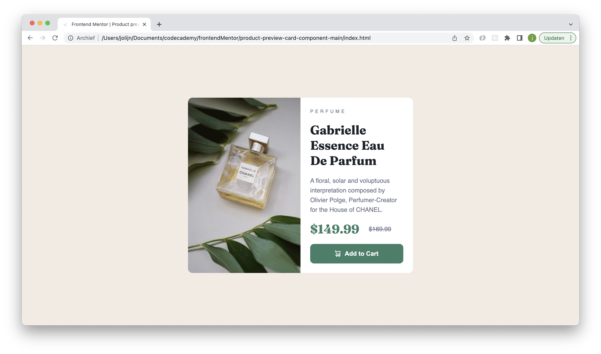

# Frontend Mentor - Product preview card component

I made this product preview card component with the design of Fronted Mentor. [See the challenge on Frontend Mentor.](https://www.frontendmentor.io/challenges/product-preview-card-component-GO7UmttRfa) Fronted Mentor provides coding challenges for frontend developers.

## The challenge

The challenge was to code a product preview card that looks exactly like the given jpg files. They provided also a styleguide, images and a jpg file how the active state of the button should look like.

## Screenshots

## My experience

This was a great challenge. I learned more about making someone else's design working and how to use a styleguide and design files. It is a nice experience that I only had to focus on the coding part instead of doing both. I would like to make more challenges in the future.

### Links

- Solution URL: [github repository](https://github.com/Jolijn0101/Product-preview-card-component)
- Live Site URL: [github page](https://jolijn0101.github.io/Product-preview-card-component/)
